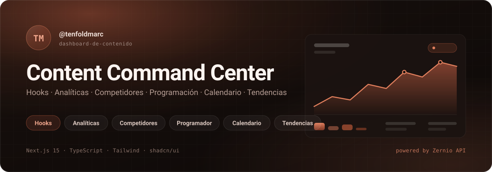
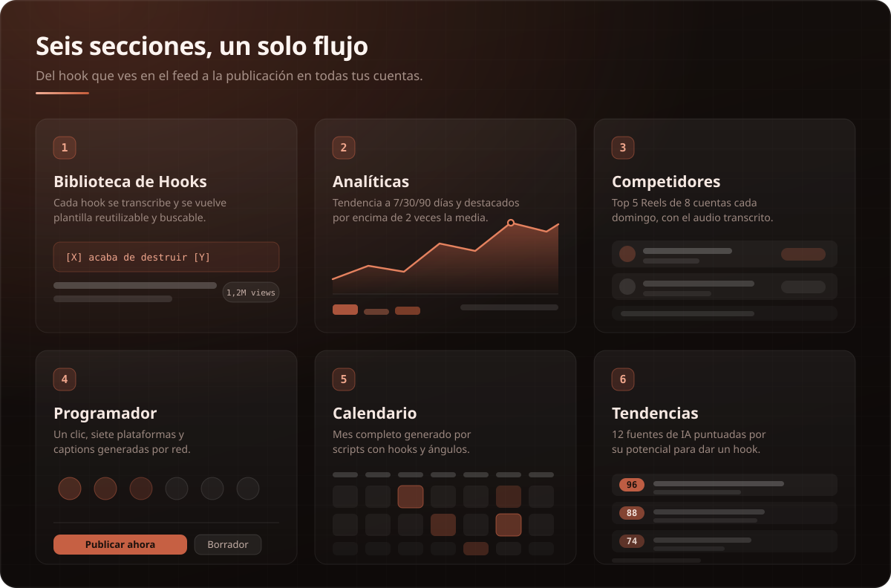
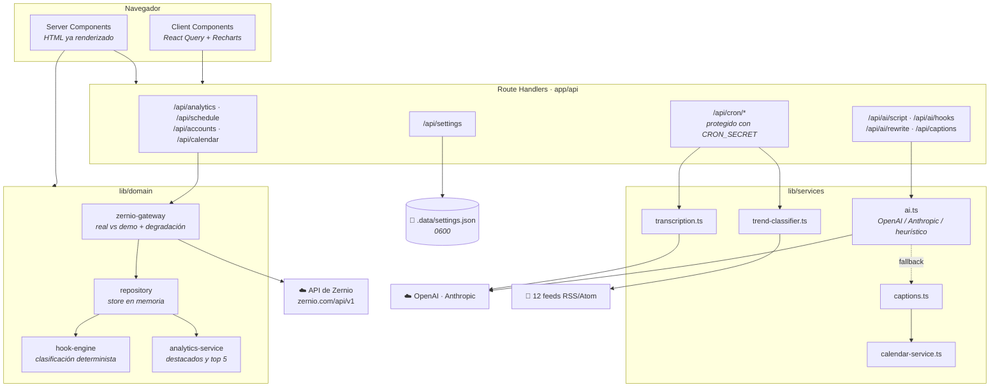
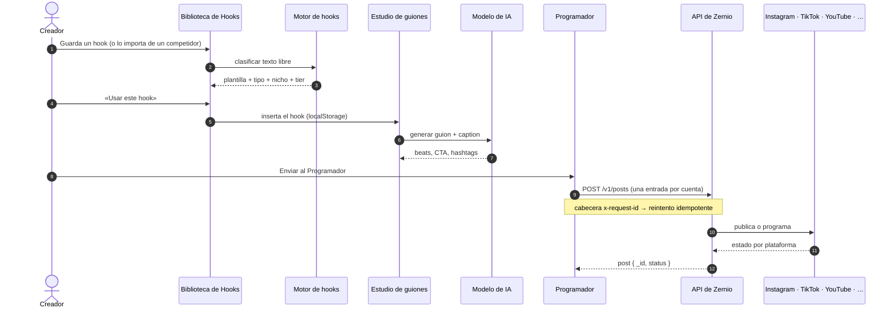
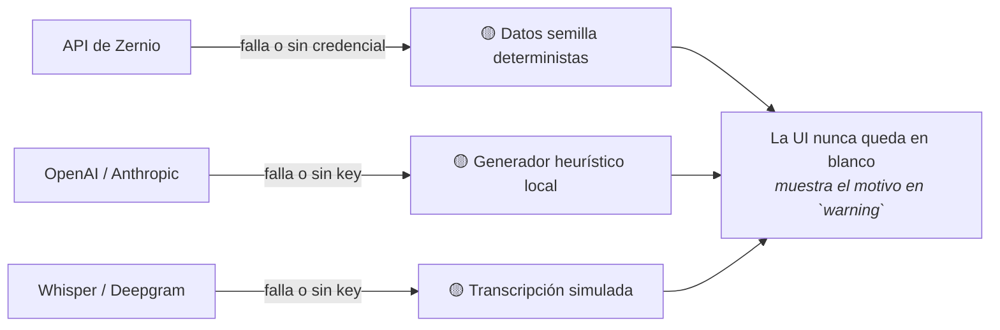

<div align="center">



<br/>

**Seis secciones para capturar hooks, medir lo que funciona, vigilar a tu competencia y publicar en todas tus cuentas con un clic.**

Construido sobre la [API de Zernio](https://docs.zernio.com) · Next.js 15 · TypeScript · Tailwind · shadcn/ui · modo oscuro con acentos terracota

**por [nocodeveloper · Joel Araujo](https://github.com/iamnocodeveloper)**

<br/>

[](https://github.com/iamnocodeveloper/content-command-center/actions/workflows/ci.yml)
[](./LICENSE)
[](https://nextjs.org)
[](https://www.typescriptlang.org)
[](https://tailwindcss.com)
[](https://ui.shadcn.com)
[](./Dockerfile)

<br/>

[**Arranque rápido**](#-arranque-rápido) · [**Las seis secciones**](#-las-seis-secciones) · [**Arquitectura**](#-arquitectura) · [**Despliegue**](#-despliegue) · [**Documentación**](#-documentación)

</div>

---

## ⚡ Respuestas rápidas

| Pregunta | Respuesta |
|---|---|
| **¿Se puede compartir en GitHub?** | Sí. No hay secretos ni binarios en el repo: `.env.local`, `.data/` y `.commandcode/` están en `.gitignore`. |
| **¿Se despliega rápido?** | Sí. Un clic en Vercel o `docker compose up`. Ambos caminos están probados y documentados. |
| **¿La memoria es local?** | Sí. El store de hooks, competidores, tendencias y plan vive **en memoria del proceso Node** (colgado de `globalThis`). Persiste entre recargas en desarrollo, pero se pierde al reiniciar y **no se comparte entre instancias**. Está aislado en un único archivo para poder cambiarlo. |
| **¿Se conecta a alguna base de datos?** | **No por defecto.** Funciona sin base de datos: Zernio es la fuente de verdad de publicaciones y métricas, y el resto vive en memoria con datos semilla. Si necesitas persistencia real, hay una ruta de migración a Postgres con el modelo completo en [`docs/03-bases-de-datos.md`](./docs/03-bases-de-datos.md). |
| **¿Necesita credenciales para arrancar?** | No. Arranca en **modo demo** con datos semilla deterministas, así que las seis secciones son navegables desde el primer segundo. |
| **¿Dónde se guardan las credenciales?** | En `.data/settings.json` con permisos `0600`, o en variables de entorno. Nunca se envían al navegador: la API sólo devuelve una versión enmascarada. |

---

## 📸 Las seis secciones



| # | Sección | Ruta | Qué resuelve |
|:-:|---|---|---|
| 1 | **Biblioteca de Hooks** | `/hooks` | Cada hook guardado se transcribe y se normaliza a plantilla — `[X] acaba de destruir [Y]`, `Deja de hacer [X]`, `[NÚMERO] cosas que me hubiera gustado saber`. Búsqueda por **nicho, tipo de hook y visualizaciones**, con creador original, views y botón **«Usar este hook»**. |
| 2 | **Analíticas** | `/analytics` | Vistas, guardados, nuevos seguidores y volumen de interacción con tendencia a **7 / 30 / 90 días**. Marca como **contenido destacado** todo reel que supere **2× la media de 30 días** y explica el **top 5** según sus propias señales. |
| 3 | **Seguimiento de Competidores** | `/competitors` | Cada **domingo a las 06:00** analiza los **5 mejores Reels de 8 cuentas**: transcribe el audio y extrae el hook y el texto en pantalla, ordenados por views, con seguidores del creador y botón **«Guardar en el Banco de Hooks»**. |
| 4 | **Programador** | `/scheduler` | **Publicación multiplataforma con un solo clic** y generación automática de captions por red (12 hashtags en Instagram, 2 en X). Programar, publicar ahora o guardar borrador. |
| 5 | **Calendario de Contenido** | `/calendar` | Vista mensual **completada automáticamente por scripts** que cruzan hooks con ángulos de contenido y colocan cada pieza en el mejor hueco de engagement. Al hacer clic, panel lateral con el guion completo y la caption. |
| 6 | **Tendencias** | `/trends` | Noticias de IA de **12 fuentes**, clasificadas con un **hook score 0-100**, ángulo de contenido y hook sugerido listo para producción. |

Rutas de apoyo: **`/script`** (estudio de guiones donde aterriza «Usar este hook») y **`/settings`** (conexiones con Zernio y con el modelo de IA).

---

## 🚀 Arranque rápido

```bash
git clone https://github.com/iamnocodeveloper/content-command-center.git
cd content-command-center

npm install --include=dev
npm run dev
```

Abre **http://localhost:3000**. Arranca en **modo demo**: verás 22 hooks clasificados, 8 competidores con 40 reels transcritos, 180 días de analíticas y las 12 fuentes de tendencias, todo sin configurar nada.

> **Nota sobre `NODE_ENV`**: si tu shell tiene `NODE_ENV=production`, npm omite las devDependencies y `tsc`/`eslint` desaparecen. Usa siempre `npm install --include=dev`.

### Conectar datos reales

Ve a **`/settings`** y pega:

1. **API key de Zernio** (`sk_…`, desde [zernio.com/dashboard/api-keys](https://zernio.com/dashboard/api-keys)) y el **Profile ID** que agrupa tus cuentas. Pulsa *Probar conexión* — llama de verdad a `GET /v1/accounts` antes de guardar.
2. **Modelo de IA** (OpenAI o Anthropic) para que los guiones, captions y variaciones se escriban con IA. Sin él, el generador heurístico local sigue funcionando.

---

## 🏗 Arquitectura



### Flujo completo: del feed a la publicación



### Resiliencia: cada integración tiene una versión local



---

## 🧩 Stack

| Capa | Elección | Por qué |
|---|---|---|
| Framework | **Next.js 15** (App Router) | Server Components leen la API sin exponer la key; Route Handlers para las integraciones. |
| Lenguaje | **TypeScript 5.7** `strict` | El contrato de Zernio está modelado a mano en `lib/zernio/types.ts`. |
| UI | **React 19** + **shadcn/ui** | Componentes copiados al repo, no instalados: control total, cero sorpresas de versionado. |
| Estilos | **Tailwind CSS 3.4** | Tokens en variables HSL, tema oscuro cálido con acento terracota. |
| Gráficas | **Recharts 2** | Área + barras responsivas en Analíticas. |
| Datos cliente | **TanStack Query 5** | `initialData` desde el servidor y refetch por filtros. |
| Validación | **Zod 3** | Todos los route handlers validan su body. |
| IA | **OpenAI · Anthropic · heurístico** | Un único punto de entrada con degradación garantizada. |
| Despliegue | **Vercel · Docker · Node** | `output: standalone` para una imagen mínima. |

Cada decisión está razonada en [`CLAUDE.md`](./CLAUDE.md), incluidas las alternativas descartadas.

---

## 📦 Despliegue

### Vercel (el más rápido)

[](https://vercel.com/new/clone?repository-url=https%3A%2F%2Fgithub.com%2Fiamnocodeveloper%2Fcontent-command-center&project-name=content-command-center)

Añade `ZERNIO_API_KEY`, `ZERNIO_PROFILE_ID` y `CRON_SECRET` en **Environment Variables**. `vercel.json` ya declara los dos cron.

> **Importante en serverless**: el sistema de archivos es efímero, así que `.data/settings.json` no persiste. En Vercel usa **variables de entorno** en lugar del panel; la precedencia está pensada para esto.

### Docker

```bash
docker compose up -d --build     # el volumen ccc-data persiste las credenciales
```

O manualmente:

```bash
docker build -t content-command-center .
docker run -p 3000:3000 -v ccc-data:/app/.data \
  -e ZERNIO_API_KEY=sk_... -e CRON_SECRET=... content-command-center
```

### Checklist de producción

- [ ] `ZERNIO_API_KEY` y `ZERNIO_PROFILE_ID` verificados con *Probar conexión*.
- [ ] Al menos una cuenta conectada en Zernio.
- [ ] Add-on de **Analytics** activo (necesario para seguidores y métricas completas).
- [ ] `CRON_SECRET` definido — sin él `/api/cron/*` queda público.
- [ ] Almacenamiento persistente para `.data` **o** credenciales sólo por variables de entorno.
- [ ] **Autenticación añadida** si el dashboard se expone en internet.

Guía completa, cron en UTC y solución de problemas: [`docs/08-despliegue.md`](./docs/08-despliegue.md).

---

## 📚 Documentación

| Documento | Contenido |
|---|---|
| [`CLAUDE.md`](./CLAUDE.md) | **Empieza aquí.** Stack, arquitectura y las 13 decisiones técnicas con su motivo. |
| [`docs/01-proyecto.md`](./docs/01-proyecto.md) | Visión, alcance y recorrido de usuario por las seis secciones. |
| [`docs/02-arquitectura.md`](./docs/02-arquitectura.md) | Capas, flujos de datos y frontera servidor/cliente. |
| [`docs/03-bases-de-datos.md`](./docs/03-bases-de-datos.md) | Modelo de datos completo, store actual y migración a Postgres. |
| [`docs/04-diseno.md`](./docs/04-diseno.md) | Design system: tokens, terracota, tipografía, accesibilidad. |
| [`docs/05-reglas-negocio.md`](./docs/05-reglas-negocio.md) | Todos los umbrales y fórmulas: 2× la media, hook score, tiers, huecos óptimos. |
| [`docs/06-integraciones.md`](./docs/06-integraciones.md) | Zernio y transcripción: endpoints, errores, idempotencia y cron. |
| [`docs/07-ia-generativa.md`](./docs/07-ia-generativa.md) | Proveedores de IA, prompts y estrategia de degradación. |
| [`docs/08-despliegue.md`](./docs/08-despliegue.md) | Local, Docker, Vercel y problemas frecuentes. |
| [`docs/09-api-referencia.md`](./docs/09-api-referencia.md) | Referencia de los 18 endpoints propios. |
| [`docs/10-publicar-en-github.md`](./docs/10-publicar-en-github.md) | Publicar el repo, revisión de seguridad previa y checklist posterior. |
| [`docs/11-atribucion.md`](./docs/11-atribucion.md) | El crédito de autoría del sidebar y el verificador que impide quitarlo sin romper el build. |

---

## 🗂 Estructura

```
app/
  (dashboard)/              9 páginas: hooks, analytics, competitors,
                            scheduler, calendar, trends, script, settings
  api/                      18 route handlers + 2 cron
  icon.tsx                   favicon generado en build
  opengraph-image.tsx        tarjeta social generada en build
components/
  ui/                       22 primitivos shadcn/ui
  <feature>/                un directorio por sección
lib/
  zernio/                   cliente tipado de la API de Zernio
  domain/                   modelo propio, motor de hooks, analíticas, repositorio
  services/                 IA, captions, transcripción, calendario, clasificador
  server/                   configuración persistida y guardas de cron
docs/                       documentación + assets
scripts/                    ingesta manual por CLI
```

---

## 🎨 Detalles de diseño

- **Modo oscuro cálido por defecto.** Superficies con matiz 24 (naranja apagado), no gris frío, para que el terracota no se vea sucio al lado.
- **Terracota como único acento** (`#c65d3b` / `#d9694a`), aclarado en oscuro para cumplir contraste AA.
- **Cero librerías de gráficas en los KPI**: las sparklines son SVG propio.
- **Fuentes self-hosted** (`geist`): el build no depende de la red.

---

## 👤 Autor

**nocodeveloper · Joel Araujo**

Construí esto para organizar mi propio contenido y lo dejo abierto por si te sirve.

[](https://github.com/iamnocodeveloper)

<!-- 🌐 Sitio web: añade aquí tu URL cuando la tengas -->

---

## ☕ Invítame un café… o una birra 🍺

El proyecto es open source y sin ánimo de lucro. Si te ahorra tiempo cada semana, puedes invitarme a un café — o directamente a una birra, que también se agradece 😄

<div align="center">

[](https://paypal.me/nocodeship2024?locale.x=es_XC&country.x=EC)
[](https://www.binance.com/es/pay)

**Binance Pay** → `joeldavidar@gmail.com`

**PayPal** → [paypal.me/nocodeship2024](https://paypal.me/nocodeship2024?locale.x=es_XC&country.x=EC)

</div>

---

## 📄 Licencia

[MIT](./LICENSE) © 2026 nocodeveloper · Joel Araujo

<div align="center">
<br/>

<br/><br/>
<sub><b>nocodeveloper · Joel Araujo</b></sub>
<br/>
<sub>Construido con <a href="https://docs.zernio.com">la API de Zernio</a> · 16 plataformas, una sola API</sub>
<br/>
<sub>Si te sirvió, <a href="https://paypal.me/nocodeship2024?locale.x=es_XC&country.x=EC">invítame una birra 🍺</a></sub>
</div>
